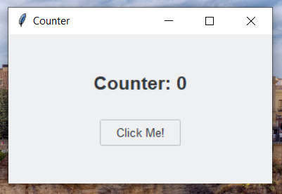

# counter_program
A counter program written in Python using Tkinter.



## Setup the program

Create virtual environment
```
python -m venv venv
```

Install dependencies
```
pip install -r .\requirement.txt
```

Compile the Python code via py_compile
```
python .\compile.py
```


